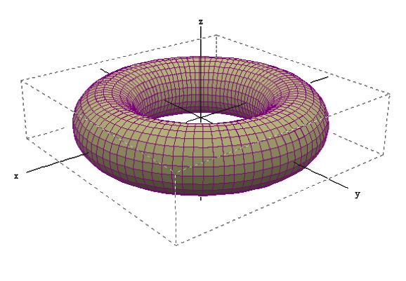

# Exercice 6

Tore et poussée d'Archimède

Un tore est un solide de révolution obtenu par la rotation d'un cercle de centre $`C`$ et de rayon $`r`$ autour d'une droite à une distance $`R`$ de son centre. La forme du tore dépend du signe de $`R-r`$.

Si $`R-r`$ est positif ou nul, on peut calculer l'aire et le volume du tore par les formules suivantes :
```math
Aire = 4 \pi^2 r R  
```
```math
Volume = 2 \pi^2 r^2 R  
```
La poussée d'Archimède exercée sur le tore entièrement immergé dans de l'eau salée sachant que la formule de la poussée d'Archimède est :
```math
F_A = \rho_{liquide} \times Volume \times g  
```

la masse volumique ($`\rho_{liquide}`$) de l'eau salée est de 1025 kg/m³ la constante gravitationnelle(g) vaut 9.81.


Ecrire un programme en langage C qui permet de calculer l'aire et le volume d'un tore dont les caractéristiques sont encodées par l'utilisateur. Calculez ensuite la poussée d'Archimède exercée sur le tore lorsqu'il est immergé dans de l'eau salée. Vérifiez que les valeurs encodées par l'utilisateur de votre programme sont acceptables. Si nécessaire, affichez des messages d'erreur.


